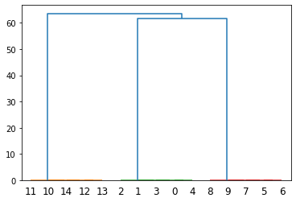
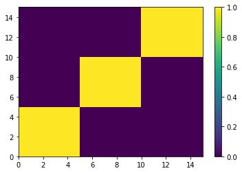
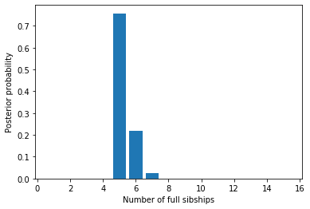
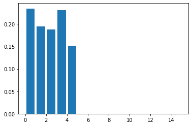

Sibship clustering
==================

Tom Ellis, March 2017, updated June 2020

.. code:: ipython3

    import faps as fp
    import numpy as np
    print("Created using FAPS version {}.".format(fp.__version__))

.. parsed-literal::

    Created using FAPS version 2.6.4.

FAPS uses information in a ``paternityArray`` to generate plausible
full-sibship configurations. This information is stored as a
``sibshipCluster`` object, and is the basis for almost all inference
about biological processes in FAPS.

This notebook will examine how to:

1. Use a ``paternityArray`` to cluster offspring into plausible
   full-sibships.
2. Compare the relative support for different partitions structures
3. Make some basic inferences about the size and number of full
   sibships, and who is related to whom.

Note that this tutorial only deals with the case where you have a single
maternal family. If you have multiple families, you can apply what is
here to each one, but you’ll have to iterate over those families. See
the specific
`tutorial <https://fractional-analysis-of-paternity-and-sibships.readthedocs.io/en/latest/tutorials/07_dealing_with_multiple_half-sib_families.html>`__
on that.

Generating a ``sibshipCluster`` object
--------------------------------------

We will begin by generating a population of 100 adults with 50 loci.

.. code:: ipython3

    np.random.seed(867)
    allele_freqs = np.random.uniform(0.3,0.5,50)
    adults = fp.make_parents(100, allele_freqs, family_name='a')

We take the first individal as the mother and mate her to four males, to
create three full sibships of five offspring. We then generate a
``paternityArray`` based on the genotype data.

.. code:: ipython3

    progeny = fp.make_sibships(adults, 0, [1,2,3], 5, 'x')
    mothers = adults.subset(progeny.mothers)
    patlik  = fp.paternity_array(progeny, mothers, adults, mu = 0.0015, missing_parents=0.01)

It is straightforward to cluster offspring into full sibships. For now
we’ll stick with the default number of Monte Carlo draws.

.. code:: ipython3

    sc = fp.sibship_clustering(patlik)

The default number of Monte Carlo draws is 1000, which seems to work in
most cases. I have dropped it to 100 in cases where I wanted to call
``sibship_clustering`` many times, such as in an MCMC loop, when finding
every possible candidate wasn’t a priority. You could also use more
draws if you really wanted to be sure you had completely sampled the
space of compatible candidate fathers. Speeds are unlikely to increase
linearly with number of draws:

.. code:: ipython3

    %timeit fp.sibship_clustering(patlik, ndraws=100)
    %timeit fp.sibship_clustering(patlik, ndraws=1000)
    %timeit fp.sibship_clustering(patlik, ndraws=10000)

.. parsed-literal::

    13.4 ms ± 603 µs per loop (mean ± std. dev. of 7 runs, 100 loops each)
    24.2 ms ± 81.9 µs per loop (mean ± std. dev. of 7 runs, 10 loops each)
    205 ms ± 4.72 ms per loop (mean ± std. dev. of 7 runs, 10 loops each)

We discussed this in figure 5 of the FAPS paper should you be interested
in more on this.

Sibling relationships
---------------------

Sibship clustering calculates likelihoods that each pair of offspring
are full siblings, then builds a dendrogram from this. We can visualise
this dendrogram if we so wish, although the output is not pretty.

.. code:: ipython3

    from scipy.cluster.hierarchy import dendrogram
    import matplotlib.pyplot as plt
    
    dendrogram(sc.linkage_matrix)
    plt.show()

Offspring individuals are labelled by their *index* in the array. Since
full sibships are of size five we should expect to see clusters of
{0,1,2,3,4}, {5,6,7,8,9} and {10,11,12,13,14}. This is indeed what we do
see. What is difficult to see on the dendrogram are the branches
connecting full siblings at the very bottom of the plot. If we bisect
this dendrogram at different places on the y-axis we can infer different
ways to partition the offspring into full siblings.

``sc`` is an object of class ``sibshipCluster`` that contains various
information about the array. Of primary interest are the set of
partition structures inferred from the dendrogram. There are sixteen
partitions - one for each individual in the array (i.e. one for each
bifurcation in the dendrogram).

.. code:: ipython3

    sc.partitions

.. parsed-literal::

    array([[ 1,  1,  1,  1,  1,  1,  1,  1,  1,  1,  1,  1,  1,  1,  1],
           [ 2,  2,  2,  2,  2,  1,  1,  1,  1,  1,  2,  2,  2,  2,  2],
           [ 3,  3,  3,  3,  3,  1,  1,  1,  1,  1,  2,  2,  2,  2,  2],
           [ 4,  4,  4,  4,  4,  1,  1,  2,  1,  1,  3,  3,  3,  3,  3],
           [ 5,  5,  5,  5,  5,  1,  1,  3,  1,  2,  4,  4,  4,  4,  4],
           [ 5,  6,  5,  5,  5,  1,  1,  3,  1,  2,  4,  4,  4,  4,  4],
           [ 6,  7,  6,  6,  6,  1,  1,  3,  1,  2,  4,  5,  4,  4,  4],
           [ 7,  8,  7,  7,  7,  1,  1,  4,  2,  3,  5,  6,  5,  5,  5],
           [ 8,  9,  8,  8,  8,  1,  2,  5,  3,  4,  6,  7,  6,  6,  6],
           [ 8, 10,  9,  8,  8,  1,  2,  5,  3,  4,  6,  7,  6,  6,  6],
           [ 8, 11, 10,  9,  8,  1,  2,  5,  3,  4,  6,  7,  6,  6,  6],
           [ 9, 12, 11, 10,  9,  1,  2,  5,  3,  4,  7,  8,  6,  6,  6],
           [10, 13, 12, 11, 10,  1,  2,  5,  3,  4,  8,  9,  6,  6,  7],
           [11, 14, 13, 12, 11,  1,  2,  5,  3,  4,  9, 10,  6,  7,  8],
           [11, 15, 14, 13, 12,  1,  2,  5,  3,  4,  9, 10,  6,  7,  8]],
          dtype=int32)

What is key about partition structures is that each symbol represents a
*unique but arbitrary* family identifier. For example in the third row
we see the true partition structure, with individuals grouped into three
groups of five individuals.

.. code:: ipython3

    sc.partitions[2]

.. parsed-literal::

    array([3, 3, 3, 3, 3, 1, 1, 1, 1, 1, 2, 2, 2, 2, 2], dtype=int32)

Beyond denoting who is in a family with whom, the labels are arbitrary,
with no meaningful order. This partition would be identical to
``[0,0,0,0,0,1,1,1,1,1,2,2,2,2,2]`` or
``[10,10,10,10,10,7,7,7,7,7,22,22,22,22,22]`` for example.

Each partition is associated with a log likelihood and equivalent log
probability. We can see from both scores that the third partition is
most consistent with the data. This is of course the true partition.

.. code:: ipython3

    print(sc.lik_partitions) # log likelihood of each partition
    print(np.exp(sc.prob_partitions)) # probabilities of each partition

.. parsed-literal::

    [-4.23560188e+02 -1.94067281e+02 -2.70500804e-04 -8.55784873e+00
                -inf            -inf            -inf            -inf
                -inf            -inf            -inf            -inf
                -inf            -inf            -inf]
    [1.12248824e-184 5.22016966e-085 9.99807953e-001 1.92047026e-004
     0.00000000e+000 0.00000000e+000 0.00000000e+000 0.00000000e+000
     0.00000000e+000 0.00000000e+000 0.00000000e+000 0.00000000e+000
     0.00000000e+000 0.00000000e+000 0.00000000e+000]

We also see that the first and second partitions have non-zero, but
small likelihoods. Parititons 5-8 have negative infinity log likelihood
- they are incompatible with the data. These partitions split up true
full siblings, and there is no way to reconcile this with the data. In
real world situations such partitions might have non-zero likelihoods if
they were an unrelated candidate male compatible with one or more
offspring through chance alone.

In some cases there can be rounding error when log probabilities are
exponentiated and probabilities do not sum to one. This is classic
machine error, and the reason it is good to work with log values
wherever possible. We can check:

.. code:: ipython3

    np.exp(sc.prob_partitions).sum()

.. parsed-literal::

    0.9999999999999999

You can directly call the most likely partition. This is somewhat
against the spirit of fractional analyses though…

.. code:: ipython3

    sc.mlpartition

.. parsed-literal::

    array([3, 3, 3, 3, 3, 1, 1, 1, 1, 1, 2, 2, 2, 2, 2], dtype=int32)

For information about fine scale relationships, ``sc.full_sib_matrix()``
returns an :math:`n*n` matrix, where :math:`n` is the number of
offspring. Each element describes the (log) probability that a pair of
individuals are full siblings, averaged over partition structures and
paternity configurations. If we plot this using a heatmap you can
clearly see the five full sibships jump out as blocks of yellow (>90%
probability of being full siblings) against a sea of purple (near zero
probability of being full siblings).

.. code:: ipython3

    sibmat = sc.full_sib_matrix()
    plt.pcolor(np.exp(sibmat))
    plt.colorbar()
    plt.show()

Note that real datasets seldom look this tidy!

Inferring family structure
--------------------------

For this section we will simulate a slightly more interesting family
structure. This block of code creates a half-sib array of 15 offspring
from five fathers, where each father contributes five, four, three, two
and one offspring respectively. It then performs sibship clustering on
the array. We use 1000 candidate males and 50 loci.

.. code:: ipython3

    # Lists indexing sires and dams
    sires = [1]*5 + [2]*4 + [3]*3 + [4]*2 +[5]*1
    dam   = [0] * len(sires)
    
    np.random.seed(542)
    allele_freqs = np.random.uniform(0.3,0.5,30)
    adults  = fp.make_parents(1000, allele_freqs, family_name='a')
    progeny = fp.make_offspring(adults, dam_list=dam, sire_list=sires)
    mothers = adults.subset(progeny.mothers)
    
    patlik  = fp.paternity_array(progeny, mothers, adults, mu= 0.0015, missing_parents=0.01)
    sc = fp.sibship_clustering(patlik)

Number of families
~~~~~~~~~~~~~~~~~~

We saw before that we could call a list of valid partitions for ``sc``
using ``sc.partitions``. The output is not terribly enlightening on its
own, however. We could instead ask how probable it is that there are *x*
full sibships in the array, integrating over all partition structures.
Here each number is the probability that there are 1, 2, …, 15 families.

.. code:: ipython3

    sc.nfamilies()

.. parsed-literal::

    array([6.09528844e-103, 4.68985495e-065, 6.19307208e-047, 9.97886140e-007,
           7.57314645e-001, 2.17024167e-001, 2.47376286e-002, 9.22561282e-004,
           0.00000000e+000, 0.00000000e+000, 0.00000000e+000, 0.00000000e+000,
           0.00000000e+000, 0.00000000e+000, 0.00000000e+000])

We could show the same information graphically. Its clear that almost
all the probability denisty is around :math:`x=5` families.

.. code:: ipython3

    %matplotlib inline
    import matplotlib.pyplot as plt
    
    fig = plt.figure()
    ax = fig.add_subplot(111)
    #ax.bar(np.arange(0.5, len(sc.nfamilies())+0.5), sc.nfamilies())
    ax.bar(np.arange(1,16), sc.nfamilies())
    ax.set_xlabel('Number of full sibships')
    ax.set_ylabel('Posterior probability')
    plt.show()

Family size
~~~~~~~~~~~

We can also get the distribution of family sizes within the array,
averaged over all partitions. This returns a vector of the same length
as the number of offspring in the array. ``family_size`` returns the
posterior probability of observing one or more families of size 1, 2, …
, 15. It will be clear that we are unable to distinguish a single
sibship with high probability from multiple families of the same size,
each with low probability; this is the price we pay for being able to
integrate out uncertainty in partition structure.

.. code:: ipython3

    sc.family_size()

.. parsed-literal::

    array([2.34867440e-001, 1.94932407e-001, 1.87748944e-001, 2.30988031e-001,
           1.51463178e-001, 0.00000000e+000, 0.00000000e+000, 0.00000000e+000,
           2.06435736e-047, 0.00000000e+000, 2.34492747e-065, 0.00000000e+000,
           0.00000000e+000, 0.00000000e+000, 6.09528844e-103])

Plotting this shows that we are roughly equally likely to observe a
family of sizes one, two, three, four and five.

.. code:: ipython3

    fig = plt.figure()
    ax = fig.add_subplot(111)
    ax.bar(np.arange(len(sires))+0.5, sc.family_size())
    
    plt.show()

Identifying fathers
-------------------

Mating events
~~~~~~~~~~~~~

We very frequently want to know who the fathers of the offspring were to
say something about mating events. There are several levels of
complexity. Firstly, you can use the ``sires`` method to return a list
of all the males who could possibly have mated with the mother.. This is
essentially identifying **mating events**, but doesn’t say anything
about the paternity of individual offspring. For many applications, that
may be all you need because it’s the mating events that are the unit of
interest, not the number of offspring per se.

Once you have a ``sibshipCluster`` object, doing this is easy:

.. code:: ipython3

    sc.sires()

.. raw:: html

    

    
    <table border="1" class="dataframe">
      <thead>
        <tr style="text-align: right;">
          <th></th>
          <th>position</th>
          <th>label</th>
          <th>log_prob</th>
          <th>prob</th>
          <th>offspring</th>
        </tr>
      </thead>
      <tbody>
        <tr>
          <td>0</td>
          <td>1</td>
          <td>a_1</td>
          <td>3.330669e-16</td>
          <td>1.000000e+00</td>
          <td>4.945498e+00</td>
        </tr>
        <tr>
          <td>1</td>
          <td>2</td>
          <td>a_2</td>
          <td>4.996004e-16</td>
          <td>1.000000e+00</td>
          <td>4.000000e+00</td>
        </tr>
        <tr>
          <td>2</td>
          <td>3</td>
          <td>a_3</td>
          <td>3.330669e-16</td>
          <td>1.000000e+00</td>
          <td>2.995992e+00</td>
        </tr>
        <tr>
          <td>3</td>
          <td>4</td>
          <td>a_4</td>
          <td>3.330669e-16</td>
          <td>1.000000e+00</td>
          <td>1.999999e+00</td>
        </tr>
        <tr>
          <td>4</td>
          <td>5</td>
          <td>a_5</td>
          <td>-1.164911e-01</td>
          <td>8.900380e-01</td>
          <td>8.872125e-01</td>
        </tr>
        <tr>
          <td>5</td>
          <td>17</td>
          <td>a_17</td>
          <td>-1.144896e+01</td>
          <td>1.066056e-05</td>
          <td>2.987473e-06</td>
        </tr>
        <tr>
          <td>6</td>
          <td>87</td>
          <td>a_87</td>
          <td>-2.207630e+00</td>
          <td>1.099610e-01</td>
          <td>1.126593e-01</td>
        </tr>
        <tr>
          <td>7</td>
          <td>254</td>
          <td>a_254</td>
          <td>-2.230188e+00</td>
          <td>1.075082e-01</td>
          <td>2.385890e-02</td>
        </tr>
        <tr>
          <td>8</td>
          <td>257</td>
          <td>a_257</td>
          <td>-3.580195e+00</td>
          <td>2.787027e-02</td>
          <td>6.023169e-03</td>
        </tr>
        <tr>
          <td>9</td>
          <td>288</td>
          <td>a_288</td>
          <td>-7.355141e+00</td>
          <td>6.392971e-04</td>
          <td>1.791514e-04</td>
        </tr>
        <tr>
          <td>10</td>
          <td>376</td>
          <td>a_376</td>
          <td>-2.900265e+00</td>
          <td>5.500863e-02</td>
          <td>1.201891e-02</td>
        </tr>
        <tr>
          <td>11</td>
          <td>388</td>
          <td>a_388</td>
          <td>-3.611815e+00</td>
          <td>2.700280e-02</td>
          <td>6.031984e-03</td>
        </tr>
        <tr>
          <td>12</td>
          <td>407</td>
          <td>a_407</td>
          <td>-1.551630e+02</td>
          <td>4.107187e-68</td>
          <td>1.683410e-05</td>
        </tr>
        <tr>
          <td>13</td>
          <td>555</td>
          <td>a_555</td>
          <td>-8.472447e+00</td>
          <td>2.091525e-04</td>
          <td>5.861120e-05</td>
        </tr>
        <tr>
          <td>14</td>
          <td>631</td>
          <td>a_631</td>
          <td>-5.044193e+00</td>
          <td>6.446661e-03</td>
          <td>1.519225e-03</td>
        </tr>
        <tr>
          <td>15</td>
          <td>639</td>
          <td>a_639</td>
          <td>-4.414452e+00</td>
          <td>1.210118e-02</td>
          <td>1.378957e-03</td>
        </tr>
        <tr>
          <td>16</td>
          <td>668</td>
          <td>a_668</td>
          <td>-7.049834e+00</td>
          <td>8.675530e-04</td>
          <td>1.006159e-04</td>
        </tr>
        <tr>
          <td>17</td>
          <td>671</td>
          <td>a_671</td>
          <td>-6.550688e+00</td>
          <td>1.429132e-03</td>
          <td>3.553637e-04</td>
        </tr>
        <tr>
          <td>18</td>
          <td>680</td>
          <td>a_680</td>
          <td>-4.393632e+00</td>
          <td>1.235578e-02</td>
          <td>1.382046e-03</td>
        </tr>
        <tr>
          <td>19</td>
          <td>690</td>
          <td>a_690</td>
          <td>-7.362603e+00</td>
          <td>6.345446e-04</td>
          <td>1.778198e-04</td>
        </tr>
        <tr>
          <td>20</td>
          <td>693</td>
          <td>a_693</td>
          <td>-4.351071e+00</td>
          <td>1.289300e-02</td>
          <td>3.034105e-03</td>
        </tr>
        <tr>
          <td>21</td>
          <td>736</td>
          <td>a_736</td>
          <td>-1.316034e+01</td>
          <td>1.925462e-06</td>
          <td>4.897118e-07</td>
        </tr>
        <tr>
          <td>22</td>
          <td>797</td>
          <td>a_797</td>
          <td>-7.578541e+00</td>
          <td>5.113068e-04</td>
          <td>2.581523e-04</td>
        </tr>
        <tr>
          <td>23</td>
          <td>839</td>
          <td>a_839</td>
          <td>-1.003268e+01</td>
          <td>4.394039e-05</td>
          <td>8.842509e-05</td>
        </tr>
        <tr>
          <td>24</td>
          <td>852</td>
          <td>a_852</td>
          <td>-1.141146e+01</td>
          <td>1.106793e-05</td>
          <td>2.869368e-05</td>
        </tr>
        <tr>
          <td>25</td>
          <td>871</td>
          <td>a_871</td>
          <td>-5.982310e+00</td>
          <td>2.522992e-03</td>
          <td>7.070227e-04</td>
        </tr>
        <tr>
          <td>26</td>
          <td>963</td>
          <td>a_963</td>
          <td>-7.278814e+00</td>
          <td>6.900035e-04</td>
          <td>6.951732e-04</td>
        </tr>
        <tr>
          <td>27</td>
          <td>965</td>
          <td>a_965</td>
          <td>-7.583015e+00</td>
          <td>5.090240e-04</td>
          <td>1.426447e-04</td>
        </tr>
      </tbody>
    </table>
    

The columns in the output tell you several bits of information. The most
interesting of these are:

1. **label** is the name of the candidate father
2. **prob** is the probability that the male sired at least one
   offspring with the mother, as a weighted average over partition
   structures. For example,
3. **offspring** shows the expected number of offspring sired by the
   male, as a weighted average over partition structures. Specifically,
   it’s the sum over rows from ``posterior_paternity_matrix``; see below.

Note that if you have multiple maternal families the output will look a
bit different. See the `tutorial on multiple maternal
families <https://fractional-analysis-of-paternity-and-sibships.readthedocs.io/en/latest/tutorials/07_dealing_with_multiple_half-sib_families.html#clustering-multiple-families>`__
for more.

We can check this table makes sense by reviewing who the real fathers
really are. This snippet gives a list of the names of the five true
fathers, followed by the number of offspring sired by each.

.. code:: ipython3

    np.unique(patlik.fathers, return_counts=True)

.. parsed-literal::

    (array(['a_1', 'a_2', 'a_3', 'a_4', 'a_5'], dtype='<U5'),
     array([5, 4, 3, 2, 1]))

The first five rows of the table above show that these fathers have
posterior probabilities of paternity of one or close to one, and seem to
have sired the correct numbers of offspring each. Of note is that
although a_1 to a_4 have posterior probabilities of exactly one, the
posterior probability for a_5 is slightly less than one. This is because
the first four fathers sired multiple offspring, and there is shared
information between siblings about the father, but this is not the case
for father a_5.

After the true fathers there are a long list of extra candidates with
very low posterior probabilities of paternity. In this case we know they
are not true fathers, but in real life we would not, and we would like
to account for this uncertainty.

Paternity of individuals
~~~~~~~~~~~~~~~~~~~~~~~~

If you are interested in the paternity of individual offspring we can
look at the output of the ``posterior_paternity_matrix`` method of
``sibshipCluster`` objects. This returns a matrix with a row for every
offspring and a column for every candidate, plus an extra column for
absent fathers.

.. code:: ipython3

    sc.posterior_paternity_matrix().shape

.. parsed-literal::

    (15, 1001)

Rows sum to one, so each row can be interpreted as a Dirichlet
distribution:

.. code:: ipython3

    np.exp(sc.posterior_paternity_matrix()).sum(axis=1)

.. parsed-literal::

    array([1., 1., 1., 1., 1., 1., 1., 1., 1., 1., 1., 1., 1., 1., 1.])

This is similar to ``patlik.prob_array()`` in that each element is
interpreted as the probability of that the offspring in a given row was
sired by the father in a given column, except that the elements in the
matrix are now averaged over partition structures. For example, compare
the rows for the first five offspring, who are all full siblings, for
the first three candidates before and after clustering into sibships:

.. code:: ipython3

    # Before
    patlik.prob_array()[:5, :3]

.. parsed-literal::

    array([[-3.38800429e+01, -1.40506263e-01, -3.16818671e+01],
           [-2.86253234e+01, -3.09240212e-03, -3.13437568e+01],
           [-3.96961398e+01, -1.51388217e-01, -3.16927491e+01],
           [-3.30893781e+01, -3.77506793e-02, -2.56419899e+01],
           [-2.81879852e+01, -2.53663440e-01, -3.24829336e+01]])

.. code:: ipython3

    # After 
    sc.posterior_paternity_matrix()[:5, :3]

.. parsed-literal::

    array([[-1.02401752e+02, -1.11022302e-16, -9.54746212e+01],
           [-1.02401752e+02, -1.11022302e-16, -9.54746212e+01],
           [-4.66844966e+01, -1.29615385e-04, -3.86811058e+01],
           [-1.02401752e+02, -1.11022302e-16, -9.54746212e+01],
           [-2.96039788e+01, -5.59067869e-02, -3.38989272e+01]])

In both cases you can see that the mother has low support as a father
(left-most column), and the true father (middle column) has the highest
support (these are log probabilities, so negative values closest to zero
reflect stronger support). However, comparing the two show the added
power gained from incorporating information about sibling relationships
into identifying the fathers; log probabilties for the true father are
orders of magnitude smaller in the second array than the first.
