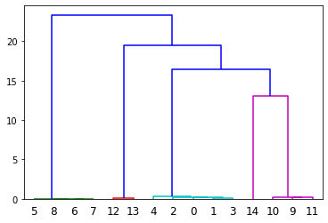
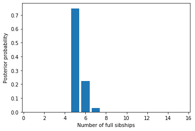
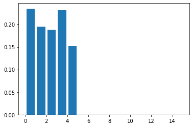
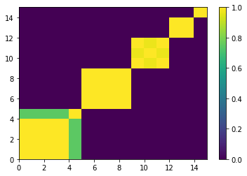

Sibship clustering
==================

Tom Ellis, March 2017

FAPS uses information in a ``paternityArray`` to generate plausible
full-sibship configurations. This information is stored as a
``sibshipCluster`` object, and is the basis for almost all inference
about biological processes in FAPS.

This notebook will examine how to:

1. Use a ``paternityArray`` to cluster offspring into plausible
   full-sibships.
2. Compare the relative support for different partitions structures
3. Make some basic inferences about the size and number of full
   sibships, and who is related to whom.

If the goal of your study is to say something about how specific
phenotypes or geography influence patterns of mating, you can then use
your ``sibshipArray`` to `sample likely mating
events <https://github.com/ellisztamas/faps/blob/master/docs/05%20Inference%20about%20mating%20patterns.ipynb>`__,
accounting fo uncertainty in sibship structure.

Generating a ``sibshipCluster`` object
--------------------------------------

We will begin by generating a population of 100 adults with 50 loci.

.. code:: ipython3

    import faps as fp
    import numpy as np
    
    np.random.seed(867)
    allele_freqs = np.random.uniform(0.3,0.5,50)
    adults = fp.make_parents(100, allele_freqs, family_name='a')

We take the first individal as the mother and mate her to four males, to
create three full sibships of five offspring. We then generate a
``paternityArray`` based on the genotype data.

.. code:: ipython3

    progeny = fp.make_sibships(adults, 0, [1,2,3], 5, 'x')
    mothers = adults.subset(progeny.parent_index('m', adults.names))
    patlik  = fp.paternity_array(progeny, mothers, adults, mu = 0.0015)

It is straightforward to cluster offspring into full sibships. For now
we'll stick with the default number of Monte Carlo draws.

.. code:: ipython3

    sc = fp.sibship_clustering(patlik, ndraws=1000)

Sibship clustering calculates likelihoods that each pair of offspring
are full siblings, then builds a dendrogram from this. We can visualise
this dendrogram if we so wish, although the output is not pretty.

.. code:: ipython3

    from scipy.cluster.hierarchy import dendrogram
    import matplotlib.pyplot as plt
    
    dendrogram(sc.linkage_matrix)
    plt.show()

Offspring individuals are labelled by their *index* in the array. Since
full sibships are of size five we should expect to see clusters of
{0,1,2,3,4}, {5,6,7,8,9} and {10,11,12,13,14}. This is indeed what we do
see. What is difficult to see on the dendrogram are the branches
connecting full siblings at the very bottom of the plot. If we bisect
this dendrogram at different places on the y-axis we can infer different
ways to partition the offspring into full siblings.

``sc`` is an object of class ``sibshipCluster`` that contains various
information about the array. Of primary interest are the set of
partition structures inferred from the dendrogram. There are sixteen
partitions - one for each individual in the array (i.e. one for each
bifurcation in the dendrogram).

.. code:: ipython3

    sc.partitions

.. parsed-literal::

    array([[ 1,  1,  1,  1,  1,  1,  1,  1,  1,  1,  1,  1,  1,  1,  1],
           [ 2,  2,  2,  2,  2,  1,  1,  1,  1,  1,  2,  2,  2,  2,  2],
           [ 3,  3,  3,  3,  3,  1,  1,  1,  1,  1,  2,  2,  2,  2,  2],
           [ 4,  4,  4,  4,  4,  1,  1,  2,  1,  1,  3,  3,  3,  3,  3],
           [ 5,  5,  5,  5,  5,  1,  1,  3,  1,  2,  4,  4,  4,  4,  4],
           [ 5,  6,  5,  5,  5,  1,  1,  3,  1,  2,  4,  4,  4,  4,  4],
           [ 6,  7,  6,  6,  6,  1,  1,  3,  1,  2,  4,  5,  4,  4,  4],
           [ 7,  8,  7,  7,  7,  1,  1,  4,  2,  3,  5,  6,  5,  5,  5],
           [ 8,  9,  8,  8,  8,  1,  2,  5,  3,  4,  6,  7,  6,  6,  6],
           [ 8, 10,  9,  8,  8,  1,  2,  5,  3,  4,  6,  7,  6,  6,  6],
           [ 8, 11, 10,  9,  8,  1,  2,  5,  3,  4,  6,  7,  6,  6,  6],
           [ 9, 12, 11, 10,  9,  1,  2,  5,  3,  4,  7,  8,  6,  6,  6],
           [10, 13, 12, 11, 10,  1,  2,  5,  3,  4,  8,  9,  6,  6,  7],
           [11, 14, 13, 12, 11,  1,  2,  5,  3,  4,  9, 10,  6,  7,  8],
           [11, 15, 14, 13, 12,  1,  2,  5,  3,  4,  9, 10,  6,  7,  8]],
          dtype=int32)

What is key about partition structures is that each symbol represents a
*unique but arbitrary* family identifier. For example in the third row
we see the true partition structure, with individuals grouped into three
groups of five individuals.

.. code:: ipython3

    sc.partitions[2]

.. parsed-literal::

    array([3, 3, 3, 3, 3, 1, 1, 1, 1, 1, 2, 2, 2, 2, 2], dtype=int32)

Beyond denoting who is in a family with whom, the labels are arbitrary,
with no meaningful order. This partition would be identical to
``[0,0,0,0,0,1,1,1,1,1,2,2,2,2,2]`` or
``[10,10,10,10,10,7,7,7,7,7,22,22,22,22,22]`` for example.

Each partition is associated with a log likelihood and equivalent log
probability. We can see from both scores that the third partition is
most consistent with the data. This is of course the true partition.

.. code:: ipython3

    print(sc.lik_partitions) # log likelihood of each partition
    print(np.exp(sc.prob_partitions)) # probabilities of each partition

.. parsed-literal::

    [-4.23560188e+02 -1.94067281e+02 -2.70500804e-04 -8.55784873e+00
                -inf            -inf            -inf            -inf
                -inf            -inf            -inf            -inf
                -inf            -inf            -inf]
    [1.12248824e-184 5.22016966e-085 9.99807953e-001 1.92047026e-004
     0.00000000e+000 0.00000000e+000 0.00000000e+000 0.00000000e+000
     0.00000000e+000 0.00000000e+000 0.00000000e+000 0.00000000e+000
     0.00000000e+000 0.00000000e+000 0.00000000e+000]

We also see that the first and second partitions have non-zero, but
small likelihoods. Parititons 5-8 have negative infinity log likelihood
- they are incompatible with the data. These partitions split up true
full siblings, and there is no way to reconcile this with the data. In
real world situations such partitions might have non-zero likelihoods if
they were an unrelated candidate male compatible with one or more
offspring through chance alone.

In some cases there can be rounding error when log probabilities are
exponentiated and probabilities do not sum to one. This is classic
machine error, and the reason it is good to work with log values
wherever possible. We can check:

.. code:: ipython3

    np.exp(sc.prob_partitions).sum()

.. parsed-literal::

    0.9999999999999999

You can directly call the most likely partition. This is somewhat
against the spirit of fractional analyses though...

.. code:: ipython3

    sc.mlpartition

.. parsed-literal::

    array([3, 3, 3, 3, 3, 1, 1, 1, 1, 1, 2, 2, 2, 2, 2], dtype=int32)

How many Monte Carlo draws?
---------------------------

Calculating the likelihood of a partition structure is challenging in a
fractional framework because we need to allow for the possibility of
every candidate to be the sire of every putative full sibship, but also
disallow the possibility that two full sibships share a single father.
In the absence of a simple closed form estimator, FAPS uses Monte Carlo
simulations to draw possible fathers for each sibship proportional to
rows in the ``paternityArray``, removes cases where multiple sibships
share a father, and calculates likelihoods for the remaining cases.

The downside of this is that when the number of candidate fathers
becomes large, many Monte Carlo draws are needed to properly sample the
space of possible fathers. In the example above with 100 candidates,
increasing the number of draws makes no difference. If we make a much
larger example with 5000 candidates, 40 SNP loci, and fairly high
genotype-error rates, then increasing the number of draws means we are
able to find valid configurations for more partition structures.

.. code:: ipython3

    np.random.seed(625)
    mu = 0.003 # genotype error rate
    allele_freqs = np.random.uniform(0.3,0.5,40)
    adults  = fp.make_parents(5000, allele_freqs, family_name='a').mutations(mu)
    progeny = fp.make_sibships(adults, 0, [1,2,3,4], 5, 'x').mutations(mu)
    mothers = adults.subset(progeny.parent_index('m', adults.names))
    patlik  = fp.paternity_array(progeny, mothers, adults, mu)
    
    print(fp.sibship_clustering(patlik, ndraws=100).lik_partitions)
    print(fp.sibship_clustering(patlik, ndraws=1000).lik_partitions)
    print(fp.sibship_clustering(patlik, ndraws=10000).lik_partitions)
    print(fp.sibship_clustering(patlik, ndraws=100000).lik_partitions)

.. parsed-literal::

    [-300.14878498 -223.32087212 -114.4050134    -4.11643151   -3.71512582
       -3.75496706   -4.55420875   -5.66053219   -7.20170101          -inf
              -inf          -inf          -inf          -inf          -inf
              -inf          -inf          -inf          -inf          -inf]
    [-300.14878498 -223.32087212 -114.4050134    -4.11643151   -3.63203028
       -3.64187977   -4.32445671   -5.49924599   -6.34217909   -8.7652386
      -12.6240141   -18.72828861          -inf          -inf          -inf
              -inf          -inf          -inf          -inf          -inf]
    [-300.14878498 -223.32087212 -114.4050134    -4.11643151   -3.62330471
       -3.60846699   -4.23459848   -5.35178042   -6.16195154   -7.87753285
       -9.99059002  -17.09906634          -inf          -inf          -inf
              -inf          -inf          -inf          -inf          -inf]
    [-300.14878498 -223.32087212 -114.4050134    -4.11643151   -3.62020844
       -3.59839194   -4.21567429   -5.30184998   -6.05007985   -7.37517016
       -8.82810609  -12.82691499  -15.60558542  -18.85505458          -inf
              -inf          -inf          -inf          -inf          -inf]

Notice that the extra partitions idenitified are towards the end of the
list. These tend to be partitions where true full-sib families are
(erroneously) split into smaller groups, especially singleton families.
Likelihoods for the extra partitions are not increasing, so most of the
probability weight remains around partitions which are quite close to
the true partition.

Now consider a slightly different case where every offspring really is
in a full sibship of its own (i.e. the true partition is
``[0, 1, 2, 3, 4, 5, 6, 7, 8, 9, 10, 11, 12, 13, 14, 15, 16, 17, 18, 19]``,
which will be at the end of the lists of partitons). Likelihoods
increase as we look from the start to the end of each list, and the
final partition is the most likely for 100, 1000 and 10000 Monte Carlo
draws.

.. code:: ipython3

    np.random.seed(763)
    mu = 0.003 # genotype error rate
    allele_freqs = np.random.uniform(0.3,0.5,50)
    
    adults = fp.make_parents(5000, allele_freqs, family_name='a').mutations(mu)
    progeny = fp.make_sibships(
        parents = adults,
        dam     = 0,
        sires   = np.arange(20),
        family_size = 1,
        family_name='x'
    ).mutations(mu)
    mothers = adults.subset(progeny.parent_index('m', adults.names))
    patlik  = fp.paternity_array(progeny, mothers, adults, mu)
    
    print(fp.sibship_clustering(patlik, ndraws=100).lik_partitions)
    print(fp.sibship_clustering(patlik, ndraws=1000).lik_partitions)
    print(fp.sibship_clustering(patlik, ndraws=10000).lik_partitions)
    print(fp.sibship_clustering(patlik, ndraws=100000).lik_partitions)

.. parsed-literal::

    [-5.10167863e+02 -4.70469862e+02 -4.41730003e+02 -4.12169267e+02
     -3.38687892e+02 -3.13903372e+02 -2.65817267e+02 -2.46135927e+02
     -2.22143385e+02 -1.86506965e+02 -1.54572426e+02 -1.32405700e+02
     -1.12142708e+02 -8.41154677e+01 -6.68572681e+01 -4.96377301e+01
     -3.29178143e+01 -1.79947014e+01 -5.78805754e+00 -2.80263898e-01]
    [-5.10165728e+02 -4.70469862e+02 -4.41730003e+02 -4.12169206e+02
     -3.38686789e+02 -3.13897222e+02 -2.65814805e+02 -2.46096265e+02
     -2.22102475e+02 -1.86468403e+02 -1.54562471e+02 -1.32390225e+02
     -1.12127150e+02 -8.41008586e+01 -6.68293139e+01 -4.96112779e+01
     -3.28708075e+01 -1.79307196e+01 -5.72126058e+00 -1.19751137e-01]
    [-5.10165600e+02 -4.70469830e+02 -4.41729592e+02 -4.12168347e+02
     -3.38685737e+02 -3.13895043e+02 -2.65812508e+02 -2.46087689e+02
     -2.22094041e+02 -1.86458265e+02 -1.54559457e+02 -1.32386598e+02
     -1.12123513e+02 -8.40971259e+01 -6.68212498e+01 -4.96018329e+01
     -3.28607984e+01 -1.79152119e+01 -5.70440426e+00 -4.94517515e-02]
    [-5.10165600e+02 -4.70469798e+02 -4.41729527e+02 -4.12168104e+02
     -3.38685627e+02 -3.13894453e+02 -2.65811908e+02 -2.46085972e+02
     -2.22092092e+02 -1.86456407e+02 -1.54558425e+02 -1.32385102e+02
     -1.12121855e+02 -8.40955517e+01 -6.68180370e+01 -4.95986164e+01
     -3.28571819e+01 -1.79097544e+01 -5.69722040e+00 -2.17152577e-02]

So how many Monte Carlo draws are necessary? The short answer is: it
probably doesn't matter. In the original FAPS paper (figure 5 in that
paper) we found that increasing the number of Monte Carlo draws does
increase the amount of probability space explored, but these regions
tend to be areas of low probability. Likely configurations are found
first, and increasing the number of draws doesn't increase overall
accuracy of inferred sibship relationships.

A good rule is to use the default setting of 1000 draws. If you are
concerned about this effect you can also change the number to 100 or
10,000 and see if this alters your downstream analyses. You can also
test this explicitly with simulations using the `power analysis
tools <https://github.com/ellisztamas/faps/blob/master/docs/06%20Simulating%20data.ipynb>`__.

Inferring family structure
--------------------------

For this section we will simulate a slightly more interesting family
structure. This block of code creates a half-sib array of 15 offspring
from five fathers, where each father contributes five, four, three, two
and one offspring respectively. It then performs sibship clustering on
the array. We use 1000 candidate males and 50 loci.

.. code:: ipython3

    # Lists indexing sires and dams
    sires = [1]*5 + [2]*4 + [3]*3 + [4]*2 +[5]*1
    dam   = [0] * len(sires)
    
    np.random.seed(542)
    allele_freqs = np.random.uniform(0.3,0.5,30)
    adults  = fp.make_parents(1000, allele_freqs, family_name='a')
    progeny = fp.make_offspring(adults, dam_list=dam, sire_list=sires)
    mothers = adults.subset(progeny.parent_index('m', adults.names))
    
    patlik  = fp.paternity_array(progeny, mothers, adults, mu)
    sc = fp.sibship_clustering(patlik)

Number of families
~~~~~~~~~~~~~~~~~~

We saw before that we could call a list of valid partitions for ``sc``
using ``sc.partitions``. The output is not terribly enlightening on its
own, however. We could instead ask how probable it is that there are *x*
full sibships in the array, integrating over all partition structures.
Here each number is the probability that there are 1, 2, ..., 15
families.

.. code:: ipython3

    sc.nfamilies()

.. parsed-literal::

    array([1.54459956e-94, 2.57811788e-60, 9.18372901e-44, 7.72547191e-06,
           7.47533669e-01, 2.23504324e-01, 2.89124365e-02, 4.18453104e-05,
           0.00000000e+00, 0.00000000e+00, 0.00000000e+00, 0.00000000e+00,
           0.00000000e+00, 0.00000000e+00, 0.00000000e+00])

We could show the same information graphically. Its clear that almost
all the probability denisty is around :math:`x=5` families.

.. code:: ipython3

    %matplotlib inline
    import matplotlib.pyplot as plt
    
    fig = plt.figure()
    ax = fig.add_subplot(111)
    #ax.bar(np.arange(0.5, len(sc.nfamilies())+0.5), sc.nfamilies())
    ax.bar(np.arange(1,16), sc.nfamilies())
    ax.set_xlabel('Number of full sibships')
    ax.set_ylabel('Posterior probability')
    plt.show()

Family size
~~~~~~~~~~~

We can also get the distribution of family sizes within the array,
averaged over all partitions. This returns a vector of the same length
as the number of offspring in the array. ``family_size`` returns the
posterior probability of observing one or more families of size 1, 2,
... , 15. It will be clear that we are unable to distinguish a single
sibship with high probability from multiple families of the same size,
each with low probability; this is the price we pay for integrating out
uncertainty in partition structure.

.. code:: ipython3

    sc.family_size()

.. parsed-literal::

    array([2.36420142e-01, 1.95030543e-01, 1.86762685e-01, 2.32277965e-01,
           1.49508665e-01, 0.00000000e+00, 0.00000000e+00, 0.00000000e+00,
           3.06124300e-44, 0.00000000e+00, 1.28905894e-60, 0.00000000e+00,
           0.00000000e+00, 0.00000000e+00, 1.54459956e-94])

Plotting this shows that we are roughly equally likely to observe a
family of sizes one, two, three, four and five.

.. code:: ipython3

    fig = plt.figure()
    ax = fig.add_subplot(111)
    ax.bar(np.arange(len(sires))+0.5, sc.family_size())
    
    plt.show()

Sibling relationships
~~~~~~~~~~~~~~~~~~~~~

Often we want to know who is related to whom. ``sc.full_sib_matrix()``
returns an :math:`n*n` matrix, where :math:`n` is the number of
offspring. Each element describes the log probability that a pair of
individuals are full siblings. If we plot this using a heatmap you can
clearly see the five full sibships jump out as blocks of yellow (>90%
probability of being full siblings) against a sea of purple (near zero
probability of being full siblings).

.. code:: ipython3

    sibmat = sc.full_sib_matrix()
    plt.pcolor(np.exp(sibmat))
    plt.colorbar()
    plt.show()

Note that real datasets seldom look this tidy!
