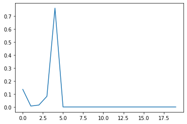

Simulating data and power analysis
==================================

Tom Ellis, August 2017

.. code:: ipython3

    import numpy as np
    import faps as fp
    import matplotlib.pylab as plt
    import pandas as pd
    from time import time, localtime, asctime
    
    print("Created using FAPS version {}.".format(fp.__version__))

.. parsed-literal::

    Created using FAPS version 2.6.6.

Before committing to the time and cost of genotyping samples for a
paternity study, it is always sensible to run simulations to test the
likely statistical power of your data set. This can help with important
questions regaridng study design, such as finding an appropriate balance
between the number of families vs offspring per family, or identifying a
minimum number of loci to type. Simulated data can also be useful in
verifying the results of an analysis.

FAPS provides tools to run such simulations. In this notebook we look
look at:

1. Basic tools for simulating genotype data.
2. Automated tools for power analysis.
3. Crafting custom simulations for specialised purposes.
4. Simulations using emprical datasets (under construction).

It is worth noting that I relied on loops for a lot of these tools, for
the purely selfish reason that it was easy to code. Loops are of course
slow, so if you work with these tools a lot there is ample scope for
speeding things up (see especially the functions ``make_offspring``,
``make_sibships`` and ``make_power``).

Simulation building blocks
--------------------------

Creating ``genotypeArray`` objects
~~~~~~~~~~~~~~~~~~~~~~~~~~~~~~~~~~

Simulations are built using ``genotypeArrays``. See the section on these
`here <http://localhost:8889/notebooks/docs/02%20Genotype%20data.ipynb>`__
for more information.

``make_parents`` generates a population of reproductive adults from
population allele frequencies. This example creates ten individuals.
Note that this population will be in Hardy-Weinberg equilibrium, but
yours may not.

.. code:: ipython3

    np.random.seed(37)
    allele_freqs = np.random.uniform(0.2, 0.5, 50)
    adults = fp.make_parents(10,  allele_freqs, family_name='adult')

There are multiple ways to mate adults to generate offspring. If you
supply a set of adults and an integer number of offspring,
``make_offspring`` mates adults at random.

.. code:: ipython3

    family1 = fp.make_offspring(parents = adults, noffs=5)
    family1.parents

.. parsed-literal::

    array(['adult_7/adult_2', 'adult_1/adult_6', 'adult_8/adult_3',
           'adult_8/adult_0', 'adult_0/adult_7'], dtype='<U15')

You can also supply an explicit list of dams and sires, in which case
the adults are paired in the order they appear in each list.

.. code:: ipython3

    family2 = fp.make_offspring(parents = adults, dam_list=[7,1,8,8,0], sire_list=[2,6,3,0,7])
    family2.parents

.. parsed-literal::

    array(['adult_7/adult_2', 'adult_1/adult_6', 'adult_8/adult_3',
           'adult_8/adult_0', 'adult_0/adult_7'], dtype='<U15')

Usually we really want to simulate half sib arrays. This can be done
using ``make_sibships``, which mates a single mother to a set of males.

.. code:: ipython3

    family3 = fp.make_sibships(parents=adults, dam=0, sires=[1,2,3,4], family_size=5)
    family3.parents

.. parsed-literal::

    array(['adult_0/adult_1', 'adult_0/adult_1', 'adult_0/adult_1',
           'adult_0/adult_1', 'adult_0/adult_1', 'adult_0/adult_2',
           'adult_0/adult_2', 'adult_0/adult_2', 'adult_0/adult_2',
           'adult_0/adult_2', 'adult_0/adult_3', 'adult_0/adult_3',
           'adult_0/adult_3', 'adult_0/adult_3', 'adult_0/adult_3',
           'adult_0/adult_4', 'adult_0/adult_4', 'adult_0/adult_4',
           'adult_0/adult_4', 'adult_0/adult_4'], dtype='<U15')

For uneven sibship sizes, give a list of sizes for each family of the
same length as ``sires``.

.. code:: ipython3

    family4 = fp.make_sibships(parents=adults, dam=0, sires=[1,2,3,4], family_size=[5,4,3,2])
    family4.parents

.. parsed-literal::

    array(['adult_0/adult_1', 'adult_0/adult_1', 'adult_0/adult_1',
           'adult_0/adult_1', 'adult_0/adult_1', 'adult_0/adult_2',
           'adult_0/adult_2', 'adult_0/adult_2', 'adult_0/adult_2',
           'adult_0/adult_3', 'adult_0/adult_3', 'adult_0/adult_3',
           'adult_0/adult_4', 'adult_0/adult_4'], dtype='<U15')

Adding errors
~~~~~~~~~~~~~

Real data almost always contains errors. For SNP data, these take the
form of:

-  Missing data, where a locus fails to amplify for some reason
-  Genotyping errors, when the observed genotype at a locus is not the
   actual genotype.

These are straightforward to include in simulated data. First generate
some clean data again, and mate the parents.

.. code:: ipython3

    np.random.seed(85)
    allele_freqs = np.random.uniform(0.2, 0.5, 50)
    adults = fp.make_parents(10,  allele_freqs, family_name='adult')
    progeny = fp.make_sibships(parents=adults, dam=0, sires=[1,2,3,4], family_size=5)

It is best to create the progeny before adding errors. Set the error
rates and add errors at random.

.. code:: ipython3

    d, mu= 0.01, 0.0015 # values for dropout and error rate.
    # add genotyping errors
    adults_mu  = adults.mutations(mu)
    progeny_mu = progeny.mutations(mu)
    
    # add dropouts (to the mutated data)
    adults_mu  = adults_mu.dropouts(d)
    progeny_mu = progeny.dropouts(d)

``mutations`` and ``dropouts`` make copies of the ``genotypeArray``, so
the original data remains unchanged. For example:

.. code:: ipython3

    print(adults.missing_data().mean())
    print(adults_mu.missing_data().mean())

.. parsed-literal::

    0.0
    0.012000000000000002

Paternity and sibships
~~~~~~~~~~~~~~~~~~~~~~

Create a ``paternityArray`` and cluster into sibships as usual (more
information on these objects can be found
`here <https://github.com/ellisztamas/faps/blob/master/docs/03%20Paternity%20arrays.ipynb>`__
and
`here <http://localhost:8889/notebooks/docs/04%20Sibship%20clustering.ipynb>`__.

.. code:: ipython3

    np.random.seed(85)
    allele_freqs = np.random.uniform(0.4, 0.5, 50)
    adults = fp.make_parents(10,  allele_freqs, family_name='adult')
    progeny = fp.make_sibships(parents=adults, dam=0, sires=[1,2,3,4], family_size=5)
    mothers = adults.subset(progeny.mothers)
    patlik = fp.paternity_array(progeny, mothers, adults, mu=0.0015, missing_parents=0.01, integration='partial')
    sc = fp.sibship_clustering(patlik)

A very useful tool is the ``accuracy`` subfunction for
``sibshipCluster`` objects. When the paternity and sibship structure are
know (seldom the case in real life, but true for simulated data) this
returns an array of handy information about the analysis:

0. Binary indiciator for whether the true partition was included in the
   sample of partitions.
1. Difference in log likelihood for the maximum likelihood partition
   identified and the true partition. Positive values indicate that the
   ML partition had greater support than the true partition.
2. Posterior probability of the true number of families.
3. Mean probabilities that a pair of true full sibs are identified as
   full sibs.
4. Mean probabilities that a pair of true half sibs are identified as
   half sibs.
5. Mean probabilities that a pair of true half or full sibs are
   correctly assigned as such (i.e. overall accuracy of sibship
   reconstruction.
6. Mean (log) probability of paternity of the true sires for those sires
   who had been sampled (who had non-zero probability in the
   paternityArray).
7. Mean (log) probability that the sire had not been sampled for those
   individuals whose sire was truly absent.

.. code:: ipython3

    sc.accuracy(progeny, adults)

.. parsed-literal::

    array([ 1.   , 28.68 ,  0.   ,  0.771,  0.952,  1.   ,  1.   ,  0.1  ])

In this example, accuracy is high, but the probability of a missing sire
is NaN because all the sires are present, and this number of calculated
only for offspring whose sire was absent.

We can adjust the ``paternityArray`` to see how much this effects the
results. For example, if we remove the sire of the first family
(i.e. the male indexed by 1), there is a drop in the accuracy for
full-sibling relationships, although half-sibling relationships are
unaffected.

.. code:: ipython3

    patlik.purge = 'adult_1'
    patlik.missing_parents=0.5
    sc = fp.sibship_clustering(patlik)
    sc.accuracy(progeny, adults)

.. parsed-literal::

    array([ 1.   , 29.38 ,  0.   ,  0.771,  0.952,  1.   ,  1.   ,  0.1  ])

In contrast, imagine we had an idea that selfing was strong. How would
this affect things?

.. code:: ipython3

    patlik.selfing_rate=0.5
    sc = fp.sibship_clustering(patlik)
    sc.accuracy(progeny, adults)

.. parsed-literal::

    array([ 1.   , 28.68 ,  0.   ,  0.771,  0.952,  1.   ,  1.   ,  0.1  ])

The results are identical to the unmodified case; FAPS has correctly
identifed the correct partition structure in spite of the (incorrect)
strong prior for high selfing.

Automation
----------

It can be tedious to put together your own simulation for every
analysis. FAPS has an automated function that repeatedly creates
genotype data, clusters into siblings and calls the ``accuracy``
function. You can supply lists of variables and it will evaluate each
combination. There are a lot of possible inputs, so have a look at the
help page using ``fp.make_power?``.

For example, this code creates four families of five full siblings with
a genotyping error rate of 0.0015. It considers 30, 40 and 50 loci for
100, 250 or 500 candidate fathers. Each parameter combination is
replicated 10 times. In reality you would want to do more than this; I
have found that results tend to asymptote with 300 simulations.

.. code:: ipython3

    # Common simulation parameters
    r            = 10 # number of replicates
    nloci        = [30,40,50] # number of loci
    allele_freqs = [0.25, 0.5] # draw allele frequencies 
    nadults      = [100,250,500] # size of the adults population
    mu           = 0.0015 #genotype error rates
    sires        = 4
    offspring    = 5
    
    np.random.seed(614)
    eventab = fp.make_power(
        replicates = r, 
        nloci = nloci,
        allele_freqs = allele_freqs,
        candidates = nadults,
        sires = sires,
        offspring = offspring, 
        missing_loci=0,
        mu_real = mu, 
        unsampled_input=0.01
    )

.. parsed-literal::

    10 of each parameter combination will be performed.
    Simulating arrays with multiple number of loci: [30, 40, 50].
    Drawing allele frequencies between 0.25 and 0.5.
    Simulating adult populations of multiple sizes: [100, 250, 500].
    Simulating 4 families of 5 offspring.
    0% of per-locus genotypes will be removed at random.
    0.15% of alleles will be mutated at random.
    Input error rates taken as the real error rates.
    No candidates to be removed.
    Proportion missing canidates set to 0.01.
    Self-fertilisation rate of 0.
    Performing 1000 Monte Carlo draws for sibship inference.
    
    Parameters set. Beginning simulations on Wed Aug 18 11:10:47 2021.

.. parsed-literal::

    100%|██████████| 10/10 [00:12<00:00,  1.26s/it]

.. parsed-literal::

    Simulations completed after 0.21 minutes.

.. parsed-literal::

    

For convenience, ``make_power`` provides a summary of the input
parameters. This can be turned off by setting ``verbose`` to ``False``.
Similarly, the progress bar can be removed by setting ``progress`` to
``False``. This bar uses iPython widgets, and probably won’t work
outside of iPython, so it may be necessary to turn them off.

The results of make_power are basically the output from the ``accuracy``
function we saw before, but include information on simulation
parameters, and the time taken to create the ``paternityArray`` and
``sibshipCluster`` objects. View them by inspecting ``eventab``.

Arguments to set up the population work much like those to create
``genotypeArrays``, and are quite flexible. Have a look into the help
file (run ``make_power?`` in Python) for more. You can also take a look
at the `simulations in support of the main FAPS
paper <http://localhost:8889/notebooks/manuscript_faps/analysis/A.%20majus%20data%20for%202012.ipynb>`__,
which considered a range of contrasting demographic scenarios; the
example above is adapted from there.

Error rates and missing candidates are important topics to get a handle
on. We can estimate these parameters (e.g. by genotyping some
individuals twice and counting how many loci are different), but we can
never completely be sure how close to reality we are. With that in mind
``make_power`` allows you to simulate true values mu and the proportion
of missing sires, but run the analysis with different values. The idea
is to estimate how wrong you could be before the analysis fails. For
example, this code would simulate the case where you thought that the
error rate was 0.0015, and 5% of the candidates went unsampled, but in
reality both parameters were double that amount.

.. code:: ipython3

    fp.make_power(r, nloci, allele_freqs, nadults, sires, offspring, 0,
               mu_input= 0.003,
               mu_real=0.0015,
               unsampled_real=0.1,
               unsampled_input = 0.05);

.. parsed-literal::

    10 of each parameter combination will be performed.
    Simulating arrays with multiple number of loci: [30, 40, 50].
    Drawing allele frequencies between 0.25 and 0.5.
    Simulating adult populations of multiple sizes: [100, 250, 500].
    Simulating 4 families of 5 offspring.
    0% of per-locus genotypes will be removed at random.
    0.15% of alleles will be mutated at random.
    Genotype error rate of 0.003 will be used to construct paternity arrays.
    Removing 10.0% of the candidates at random.
    Proportion missing canidates set to 0.05.
    Self-fertilisation rate of 0.
    Performing 1000 Monte Carlo draws for sibship inference.
    
    Parameters set. Beginning simulations on Wed Aug 18 11:11:33 2021.

.. parsed-literal::

    100%|██████████| 10/10 [00:12<00:00,  1.29s/it]

.. parsed-literal::

    Simulations completed after 0.21 minutes.

.. parsed-literal::

    

If you want to perform downstream analysis, you can tell ``make_power``
to also export each ``paternity_Array`` and/or ``sibshipCluster``
object. This is done by setting ``return_paternities`` and
``return_clusters`` to ``True``. For example, this code pulls out the
distribution of family sizes from each ``sibshipArray``, and plots it.

.. code:: ipython3

    eventab, evenclusters = fp.make_power(
        replicates = r, 
        nloci = nloci,
        allele_freqs = allele_freqs,
        candidates = nadults,
        sires = sires,
        offspring = offspring, 
        missing_loci=0,
        mu_real = mu, 
        unsampled_input=0.01,
        return_clusters=True,
        verbose=False
    )
    even_famsizes = np.array([evenclusters[i].family_size() for i in range(len(evenclusters))])
    
    plt.plot(even_famsizes.mean(0))
    plt.show()

.. parsed-literal::

    100%|██████████| 10/10 [00:12<00:00,  1.24s/it]

Custom simulations
------------------

Once you are familiar with the basic building blocks for generating data
and running analysis, creating your own simulations if largely a case of
setting up combinations of parameters, and looping over them. Given the
vast array of possible scenarios you could want to simulate, it is
impossible to be comprehensive here, so it must suffice to given a
couple of examples for inspiration.

Likelihood for missing sires
~~~~~~~~~~~~~~~~~~~~~~~~~~~~

In this example is was interested in the performance of the likelihood
estimator for a sire being absent. This is the likelihood of generating
the offspring genotype if paternal alleles come from population allele
frequencies. This is what the attribute ``lik_abset`` in a
``paternityArray`` tells you.

Ideally this likelihood should be below the likelihood of paternity for
the true sire, but higher than that of the other candidates. I suspected
this would not be the case when minor allele frequency is low and there
are many candidates.

This cell sets up the simulation. I’m considering 50 loci, and
mu=0.0015, but varying sample size and allele frequency.

.. code:: ipython3

    # Common simulation parameters
    nreps        = 10 # number of replicates
    nloci        = [50] # number of loci
    allele_freqs = [0.1, 0.2, 0.3, 0.4, 0.5] # draw allele frequencies 
    nadults      = [10, 100, 250, 500, 750, 1000] # size of the adults population
    mu_list      = [0.0015] #genotype error rates
    nsims        = nreps * len(nloci) * len(allele_freqs) * len(nadults) * len(mu_list) # total number of simulations to run
    dt           = np.zeros([nsims, 7]) # empty array to store data

This cell simulates genotype data and clusters the offspring into full
sibships. The code pulls out the mean probability that each sire is
absent, and the rank of the likelihood for a missing sire among the
likelihoods of paternity for the candidates.

.. code:: ipython3

    t0 = time()
    counter = 0
    
    print("Beginning simulations on {}.".format(asctime(localtime(time()) )))
    
    for r in range(nreps):
        for l in range(len(nloci)):
            for a in range(len(allele_freqs)):
                for n in range(len(nadults)):
                    for m in range(len(mu_list)):
                        af = np.repeat(allele_freqs[a], nloci[l])
                        adults  = fp.make_parents(nadults[n], af)
                        progeny = fp.make_offspring(adults, 100)
                        mi      = progeny.parent_index('m', adults.names) # maternal index
                        mothers = adults.subset(mi)
                        patlik  = fp.paternity_array(progeny, mothers, adults, mu_list[m], missing_parents=0.01)
                        # Find the rank of the missing term within the array.
                        rank    = [np.where(np.sort(patlik.prob_array()[i]) == patlik.prob_array()[i,-1])[0][0] for i in range(progeny.size)]
                        rank    = np.array(rank).mean() / nadults[n]
                        # get the posterior probabilty fir the missing term.
                        prob_misisng = np.exp(patlik.prob_array()[:, -1]).mean()
                        #export data
                        dt[counter] = np.array([r, nloci[l], allele_freqs[a], nadults[n], mu_list[m], rank, prob_misisng])
                        # update counters
                        counter += 1
    
    print("Completed in {} hours.".format(round((time() - t0)/3600,2)))
    
    head = ['rep', 'nloci', 'allele_freqs', 'nadults', 'mu', 'rank', 'prob_missing']
    dt = pd.DataFrame(dt, columns=head)

.. parsed-literal::

    Beginning simulations on Wed Aug 18 11:12:20 2021.
    Completed in 0.03 hours.

