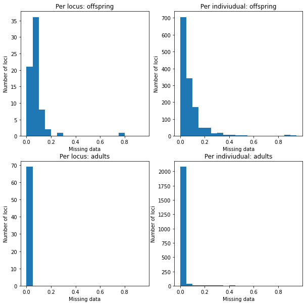
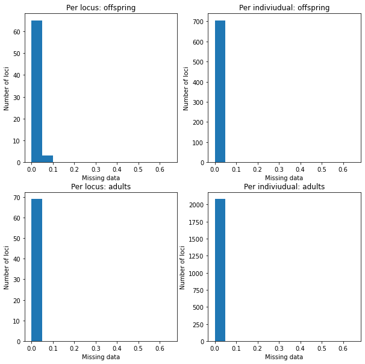
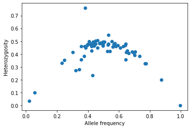
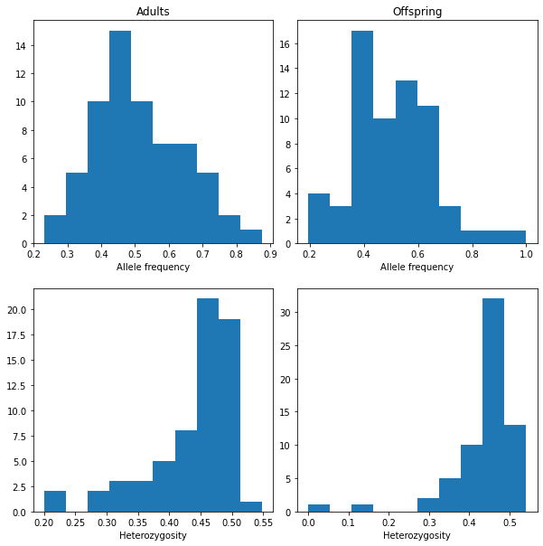
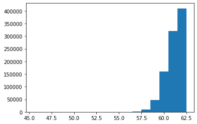
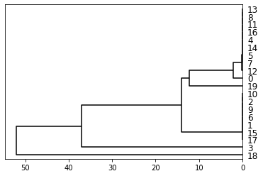
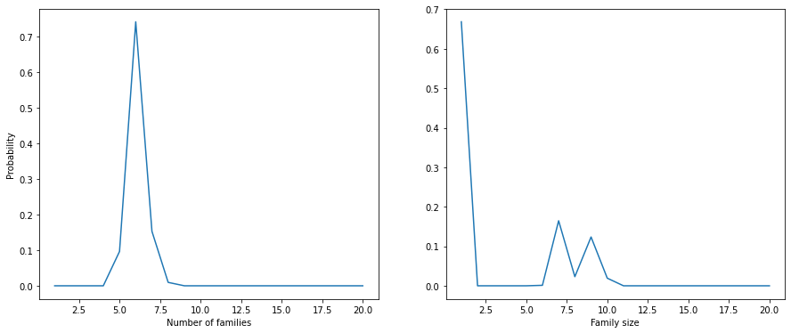
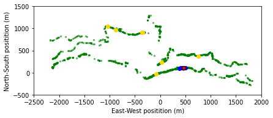
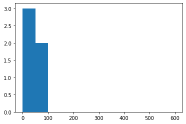

Data cleaning for *Antirrhinum majus* data set from 2012
========================================================

.. code:: ipython3

    import numpy as np
    from pandas import DataFrame as df
    import faps as fp
    import matplotlib.pyplot as plt
    %pylab inline
    
    print("Created using FAPS version {}.".format(fp.__version__))

.. parsed-literal::

    Populating the interactive namespace from numpy and matplotlib
    Created using FAPS version 2.6.4.

Tom Ellis, June 2017

In this notebook we will examine an empirical dataset using the
snapdragon *Antirrhinum majus*.

In 2012 we collected open-pollinated seed capsules from wild mothers and
genotypes samples of the offsping. A single seed capsule contains up to
several hundred seeds from between 1 and lots of pollen donors. We also
collected tissue and GPS positions for as many of the adults
reproductive plants as we could find.

These data are those desribed and analysed by Ellis *et al.* (2018), and
are available from the `IST Austria data
repository <https://datarep.app.ist.ac.at/id/eprint/95>`__
(DOI:10.15479/AT:ISTA:95).

Below, we will do an initial data inspection to weed out dubious loci
and individuals. It can be argued that this process was overly
conservative, and we threw out a lot of useful data, so you need not
necessarily be so critical of your own data.

Data inspection
---------------

Import genotype data for the reproductive adults and offspring. The
latter includes information on the ID of the maternal mother.

.. code:: ipython3

    progeny = fp.read_genotypes('../../data/offspring_SNPs_2012.csv', mothers_col=1, genotype_col=2)
    adults  = fp.read_genotypes('../../data/parents_SNPs_2012.csv')
    
    iix = [i in adults.names for i in progeny.mothers.tolist()]
    progeny = progeny.subset(iix)

Genotype information
~~~~~~~~~~~~~~~~~~~~

As a sanity check, confirm that the marker names really do match.

.. code:: ipython3

    all([progeny.markers[i] == adults.markers[i] for i in range(progeny.nloci)])

.. parsed-literal::

    True

Tissue from the adults and progeny was dried in different ways. For the
progeny, I didnt use enough silica gel to dry the tissue rapidly, and
the DNA became degraded. Reflecting this, although genotype dropouts
(the rate at which genotype information at a single locus fails to
amplify) is respectable for the adults, but dire for the offspring.

.. code:: ipython3

    print(
        "Adults:",    adults.missing_data().max(),
        "\nProgeny:", progeny.missing_data().max()
    )

.. parsed-literal::

    Adults: 0.027972027972027972 
    Progeny: 0.7916666666666666

Luckily a lot of this is driven by a small number of loci/individuals
with very high dropout rates.

.. code:: ipython3

    fig = plt.figure(figsize=(10,10))
    fig.subplots_adjust(wspace=0.2, hspace=0.2)
    
    mdo = fig.add_subplot(2,2,1)
    mdo.hist(progeny.missing_data('marker'), bins=np.arange(0, 1, 0.05))
    mdo.set_xlabel("Missing data")
    mdo.set_ylabel("Number of loci")
    mdo.set_title('Per locus: offspring')
    
    indo = fig.add_subplot(2,2,2)
    indo.hist(progeny.missing_data(by='individual'), bins=np.arange(0, 1, 0.05))
    indo.set_xlabel("Missing data")
    indo.set_ylabel("Number of loci")
    indo.set_title('Per indiviudual: offspring')
    
    mda = fig.add_subplot(2,2,3)
    mda.hist(adults.missing_data('marker'), bins=np.arange(0, 1, 0.05))
    mda.set_xlabel("Missing data")
    mda.set_ylabel("Number of loci")
    mda.set_title('Per locus: adults')
    
    inda = fig.add_subplot(2,2,4)
    inda.hist(adults.missing_data(by='individual'), bins=np.arange(0, 1, 0.05))
    inda.set_xlabel("Missing data")
    inda.set_ylabel("Number of loci")
    inda.set_title('Per indiviudual: adults')

.. parsed-literal::

    Text(0.5, 1.0, 'Per indiviudual: adults')

Although overall per locus drop-out rates are low for the adults, there
are some individuals with alarmingly high amounts of missing data.
Candidates with very few loci typed can come out as being highly
compatible with many offspring, just because there is insufficient
information to exclude them.

.. code:: ipython3

    print(
        "Adults:",   adults.missing_data(by='individual').max(),
        "\nProgeny:", progeny.missing_data('individual').max()
    )

.. parsed-literal::

    Adults: 0.8985507246376812 
    Progeny: 0.9710144927536232

Count, then remove individuals with >5% missing data.

.. code:: ipython3

    print(
        "Adults:", len(np.array(adults.names)[adults.missing_data(1) > 0.05]),
        "\nProgeny:", len(np.array(progeny.names)[progeny.missing_data(1) > 0.05])
    )
        
    adults  = adults.subset(individuals= adults.missing_data(1) < 0.05)
    progeny = progeny.subset(    individuals= progeny.missing_data(1) < 0.05)

.. parsed-literal::

    Adults: 66 
    Progeny: 688

Histograms look much better. It would still worth removing some of the
dubious loci with high drop-out rates though.

.. code:: ipython3

    fig = plt.figure(figsize=(10,10))
    fig.subplots_adjust(wspace=0.2, hspace=0.2)
    
    mdo = fig.add_subplot(2,2,1)
    mdo.hist(progeny.missing_data('marker'), bins=np.arange(0, 0.7, 0.05))
    mdo.set_xlabel("Missing data")
    mdo.set_ylabel("Number of loci")
    mdo.set_title('Per locus: offspring')
    
    indo = fig.add_subplot(2,2,2)
    indo.hist(progeny.missing_data(by='individual'), bins=np.arange(0, 0.7, 0.05))
    indo.set_xlabel("Missing data")
    indo.set_ylabel("Number of loci")
    indo.set_title('Per indiviudual: offspring')
    
    mda = fig.add_subplot(2,2,3)
    mda.hist(adults.missing_data('marker'), bins=np.arange(0, 0.7, 0.05))
    mda.set_xlabel("Missing data")
    mda.set_ylabel("Number of loci")
    mda.set_title('Per locus: adults')
    
    inda = fig.add_subplot(2,2,4)
    inda.hist(adults.missing_data(by='individual'), bins=np.arange(0, 0.7, 0.05))
    inda.set_xlabel("Missing data")
    inda.set_ylabel("Number of loci")
    inda.set_title('Per indiviudual: adults')

.. parsed-literal::

    Text(0.5, 1.0, 'Per indiviudual: adults')

Remove the loci with dropouts >10% from both the offspring and adult
datasets.

.. code:: ipython3

    print(np.array(progeny.markers)[progeny.missing_data(0) >= 0.1])
    
    progeny= progeny.subset(loci= progeny.missing_data(0) < 0.1)
    adults = adults.subset(loci = progeny.missing_data(0) < 0.1)

.. parsed-literal::

    ['s217_2722063']

Allele frequency and heterozygosity generally show the convex pattern
one would expect. An exception is the locus with allele frequency at
around 0.4, but heterozygosity >0.7, which is suspect, and indicative of
a possible outlier.

.. code:: ipython3

    plt.scatter(adults.allele_freqs(), adults.heterozygosity(0))
    plt.xlabel('Allele frequency')
    plt.ylabel('Heterozygosity')
    plt.show()

Loci with low heterozygosity are not dangerous in themselves; they might
contribute some information, albeit little. To be on the safe side,
let’s remove loci with less than 0.2 heterozygosity, and the errant
locus with high heterozygosity.

.. code:: ipython3

    print(
        "Heterozygosity > 0.7:", adults.markers[adults.heterozygosity(0) >0.7],
        "\nHeterozygosity < 0.2:", progeny.markers[adults.heterozygosity(0) < 0.2]
    )
    
    progeny = progeny.subset(loci= (adults.heterozygosity(0) > 0.2) * (adults.heterozygosity(0) < 0.7))
    adults  = adults.subset( loci= (adults.heterozygosity(0) > 0.2) * (adults.heterozygosity(0) < 0.7))

.. parsed-literal::

    Heterozygosity > 0.7: ['s217_2722063'] 
    Heterozygosity < 0.2: ['s154_504353' 's320_60828' 's316_93292']

Summary of genotype data
~~~~~~~~~~~~~~~~~~~~~~~~

This leaves us with a dataset of 61 loci for which allele frequency and
heterozygosity are highest around 0.5, which is what we would like. In
particular, heterozygosity (and hence homozygosity) among the adults is
humped around 0.5, which is a good sign that parents should be readily
distinguishable. There is nevertheless substantial spread towards zero
and one for the progeny data however, which is less than ideal.

.. code:: ipython3

    fig = plt.figure(figsize=(10,10))
    fig.subplots_adjust(wspace=0.1, hspace=0.2)
    
    afp = fig.add_subplot(2,2,1)
    afp.hist(adults.allele_freqs())
    afp.set_title('Adults')
    afp.set_xlabel("Allele frequency")
    
    afo = fig.add_subplot(2,2,2)
    afo.hist(progeny.allele_freqs())
    afo.set_title('Offspring')
    afo.set_xlabel("Allele frequency")
    
    hetp = fig.add_subplot(2,2,3)
    hetp.hist(adults.heterozygosity(0))
    hetp.set_xlabel("Heterozygosity")
    
    heto = fig.add_subplot(2,2,4)
    heto.hist(progeny.heterozygosity(0))
    heto.set_xlabel("Heterozygosity")

.. parsed-literal::

    Text(0.5, 0, 'Heterozygosity')

The effective number of loci can be seen as the number of loci at which
one can make compare the offspring, maternal and candidate paternal
genotype (i.e. those loci with no missing data). Given how high dropouts
are in the offspring, it is worthwhile to check the effective number of
loci for this dataset.

To calculate the effective number of loci, we need genotype data for the
mothers.

.. code:: ipython3

    # Check that the mother of each offspring is found in the array of adults,
    # and select only those offspring.
    ix = [i for i in range(progeny.size) if progeny.mothers[i] in adults.names]
    progeny = progeny.subset(ix)
    # Genotype data on those adults that are also mothers.
    mothers = adults.subset(progeny.parent_index('m', adults.names))

In fact, effective number of loci is good. The minimum number of valid
loci to compare is 46, and in 99% of cases there are 57 or more loci.

.. code:: ipython3

    neloci  = fp.effective_nloci(progeny, mothers, adults)
    
    plt.hist(neloci.flatten(), bins=np.arange(45.5,63.5,1))
    plt.show()

Finally, print some summary statistics about the quality of the genotype
information in the data set.

.. code:: ipython3

    print(
        "Total n. loci:", adults.nloci,
        "\nMean per-locus missing data in the adults:",  adults.missing_data(by = 'marker').mean(),
        "\nMean per-locus missing data in the progeny:", progeny.missing_data(by = 'marker').mean(),
        "\nMinimum heterozygosity at any locus:", adults.heterozygosity(by = 'marker').min(),
        "\nMaximum heterozygosity at any locus:", adults.heterozygosity(by = 'marker').max(),
        "\nLowest minor-allele frequency:",  adults.allele_freqs().min(),
        "\nHighest minor-allele frequency:", adults.allele_freqs().max()
    )

.. parsed-literal::

    Total n. loci: 64 
    Mean per-locus missing data in the adults: 0.007726070226070227 
    Mean per-locus missing data in the progeny: 0.01730390401146132 
    Minimum heterozygosity at any locus: 0.2000962000962001 
    Maximum heterozygosity at any locus: 0.5483405483405484 
    Lowest minor-allele frequency: 0.2308624031007752 
    Highest minor-allele frequency: 0.8760975609756098

Example family: L1872
---------------------

*Note from August 2021: this section includes some old and fairly ugly
list comprehensions that aren’t the clearest way to do things, which I
hope to update at some point. If you want to apply what follows to your
own work, perhaps don’t worry too much about what they are doing, and
just try to see which names you would need to substitute to apply it to
your own data.*

The ``progeny`` dataset consists of offspring from multiple families
that were genotyped at the same time. It was convenient to consider them
as one so far to tidy up the genotype data, but for subsequent analysis
we need to split them up into their constituent full sib families. This
is easy to do with ``split``, which returns a list of ``genotypeArray``
objects.

.. code:: ipython3

    prlist = progeny.split(progeny.mothers)
    len(prlist)

.. parsed-literal::

    57

By way of a sanity check we will examine one of the largest families in
detail. After the data filtering above, there are 20 offspring from
mother L1872. Distributions of missing data, heterozygosity and allele
frequency at each locus suggest no reason for alarm.

.. code:: ipython3

    ex_progeny = prlist["L1872"]
    ex_mother  = adults.subset(ex_progeny.parent_index('m', adults.names))
    
    ex_progeny.size

.. parsed-literal::

    20

Family structure
~~~~~~~~~~~~~~~~

Cluster the family into sibships. I have set the proportion of missing
parents to 0.1; we have removed 140 of the 2219 (6%) candidates logged
as alive in 2012, and I allow for 10% of candidates having been missed.
In fact the results do not depend on the parameter unless it is
unrealistically high.

.. code:: ipython3

    allele_freqs = adults.allele_freqs() # population allele frequencies
    ex_patlik    = fp.paternity_array(
        ex_progeny,
        ex_mother,
        adults,
        mu = 0.0015,
        missing_parents=0.1
    )
    ex_sc        = fp.sibship_clustering(ex_patlik, 1000)

We can first look at the dendrogram of relatedness between individuals
derived from the array of paternity likleihoods.

.. code:: ipython3

    from scipy.cluster.hierarchy import dendrogram
    dendrogram(ex_sc.linkage_matrix, orientation='left', color_threshold=0,
               above_threshold_color='black')
    plt.show()

We can compare this to the most-probable partition structure to get a
rough idea of what as going on. This partition groups offspring into 6
full sibships and has a posterior probability of 0.74. The partition
structure simply labels individuals 0 to 20 with a unique, arbitrary
identifier. For example, individuals 2 and 3 are grouped into an
especially large family labelled ‘1’.

.. code:: ipython3

    print(
        "Most-probable partition:", ex_sc.mlpartition,
        "\nUnique families:", np.unique(ex_sc.mlpartition),
        "\nPosterior probability of most-probable partition:", np.exp(ex_sc.prob_partitions.max())
    )

.. parsed-literal::

    Most-probable partition: [3 1 1 5 2 2 1 2 2 1 1 2 2 2 2 1 2 1 6 4] 
    Unique families: [1 2 3 4 5 6] 
    Posterior probability of most-probable partition: 0.7412552176970592

We can recover posterior probabilties of paternity for each candidate on
each offspring using ``prob_paternity``. For most offspring, there is a
single candidate with a probability of paternity close to one.

.. code:: ipython3

    postpat = ex_sc.prob_paternity()
    
    # Add a label for missing fathers to the end of 
    adults.names = np.append(adults.names, "missing")
    # names of most probable candidates
    mx = np.array([np.where(postpat[i].max() == postpat[i])[0][0] for i in range(ex_progeny.size)])
    
    # Print a dataframe summarising this
    df([adults.names[mx], np.exp(postpat.max(1))]).T

.. raw:: html

    

    
    <table border="1" class="dataframe">
      <thead>
        <tr style="text-align: right;">
          <th></th>
          <th>0</th>
          <th>1</th>
        </tr>
      </thead>
      <tbody>
        <tr>
          <th>0</th>
          <td>M0880</td>
          <td>0.79962</td>
        </tr>
        <tr>
          <th>1</th>
          <td>M0819</td>
          <td>1.0</td>
        </tr>
        <tr>
          <th>2</th>
          <td>M0819</td>
          <td>1.0</td>
        </tr>
        <tr>
          <th>3</th>
          <td>M0698</td>
          <td>1.0</td>
        </tr>
        <tr>
          <th>4</th>
          <td>missing</td>
          <td>1.0</td>
        </tr>
        <tr>
          <th>5</th>
          <td>missing</td>
          <td>1.0</td>
        </tr>
        <tr>
          <th>6</th>
          <td>M0819</td>
          <td>1.0</td>
        </tr>
        <tr>
          <th>7</th>
          <td>missing</td>
          <td>1.0</td>
        </tr>
        <tr>
          <th>8</th>
          <td>missing</td>
          <td>1.0</td>
        </tr>
        <tr>
          <th>9</th>
          <td>M0819</td>
          <td>1.0</td>
        </tr>
        <tr>
          <th>10</th>
          <td>M0819</td>
          <td>1.0</td>
        </tr>
        <tr>
          <th>11</th>
          <td>missing</td>
          <td>1.0</td>
        </tr>
        <tr>
          <th>12</th>
          <td>missing</td>
          <td>0.972253</td>
        </tr>
        <tr>
          <th>13</th>
          <td>missing</td>
          <td>1.0</td>
        </tr>
        <tr>
          <th>14</th>
          <td>missing</td>
          <td>1.0</td>
        </tr>
        <tr>
          <th>15</th>
          <td>M0819</td>
          <td>1.0</td>
        </tr>
        <tr>
          <th>16</th>
          <td>missing</td>
          <td>1.0</td>
        </tr>
        <tr>
          <th>17</th>
          <td>M0819</td>
          <td>0.999438</td>
        </tr>
        <tr>
          <th>18</th>
          <td>M0107</td>
          <td>1.0</td>
        </tr>
        <tr>
          <th>19</th>
          <td>M0854</td>
          <td>0.999994</td>
        </tr>
      </tbody>
    </table>
    

Family sizes
~~~~~~~~~~~~

Consistent with the results for many families (shown below), the
posterior distributions for family size suggest many small families and
a smaller number of larger families.

.. code:: ipython3

    fig = plt.figure(figsize=(15,6))
    
    nf = fig.add_subplot(1,2,1)
    nf.plot(range(1,ex_progeny.size+1), ex_sc.nfamilies())
    nf.set_xlabel('Number of families')
    nf.set_ylabel('Probability')
    
    fs = fig.add_subplot(1,2,2)
    fs.plot(range(1,ex_progeny.size+1), ex_sc.family_size())
    fs.set_xlabel('Family size')
    plt.show()

Geographic positions
~~~~~~~~~~~~~~~~~~~~

Intuitively, one would expect most pollen donors to be fairly close to
the mother. Since the most probable partition had fairly strong support
and identified a set of candidates with posterior probabilities close to
one, it is reasonable to use these individuals to get an idea of where
the pollen donors are to be found.

First, import GPS data and make sure sample IDs match genotype data.

.. code:: ipython3

    gps_pos = np.genfromtxt('../../data/amajus_GPS_2012.csv', delimiter=',', skip_header=1, usecols=[3,4]) # import CSV file
    gps_lab = np.genfromtxt('../../data/amajus_GPS_2012.csv', delimiter=',', skip_header=1, usecols=0, dtype='str') # import CSV file
    # subset GPS data to match the genotype data.
    ix = [i for i in range(len(gps_lab)) if gps_lab[i] in adults.names]
    gps_pos, gps_lab = gps_pos[ix], gps_lab[ix]

.. code:: ipython3

    ix =[i for i in range(len(gps_lab)) if gps_lab[i] in adults.names[mx]]
    gps_cands = gps_pos[ix]
    gps_ex =  gps_pos[gps_lab == "L1872"].squeeze()

The map below shows the spatial positions of all individuals in the
sample in green. Overlaid are the mother in red, and top candidates in
blue. The likley candidates are indeed found close to the mother along
the lower (southern-most) road, with two individuals on the upper
(northern) road. This gives us no cause to doubt the validity of the
paternity results.

.. code:: ipython3

    second = np.sort(postpat, 1)[:, 1]
    sx = np.array([np.where(second[i] == postpat[i])[0][0] for i in range(ex_progeny.size)])
    gps_sec = gps_pos[np.unique(sx)]

.. code:: ipython3

    fig = plt.figure(figsize=(16.9/2.54,6.75/2.54))
    #plt.figure(figsize=(12.5,5)
    
    plt.xlabel('East-West positition (m)')
    plt.ylabel('North-South positition (m)')
    plt.xlim(-2500,2000)
    plt.ylim(-500,1500)
    plt.scatter(gps_pos[:,0],  gps_pos[:,1], s=5, color='green', alpha=0.5)
    plt.scatter(gps_sec[:,0],  gps_sec[:,1], color='gold')
    plt.scatter(gps_cands[:,0],gps_cands[:,1], color='blue')
    plt.scatter(gps_ex[0], gps_ex[1], color='red', s=40, edgecolors='black')
    plt.show()

We can use these data to get a very rough dispersal kernal. Most pollen
comes from within 50m of the maternal plant.

.. code:: ipython3

    dists = np.sqrt((gps_ex[0] - gps_cands[:,0])**2 + (gps_ex[1] - gps_cands[:,1])**2)
    print("Mean dispersal of top candidates =",mean(dists), "metres")
    
    plt.hist(dists, bins=np.arange(0,650,50))
    plt.show()

.. parsed-literal::

    Mean dispersal of top candidates = 47.73636198050704 metres

In contrast, the second-most-likely candidates are on average more than
800m from the maternal plant.

.. code:: ipython3

    dists2 = np.sqrt((gps_ex[0] - gps_sec[:,0])**2 + (gps_ex[1] - gps_sec[:,1])**2)
    print("Mean dispersal of second candidates =",mean(dists2), "metres")

.. parsed-literal::

    Mean dispersal of second candidates = 887.9552522780782 metres

Multiple families
-----------------

The code becomes more challenging because we will need to perform
operations on every element in this list. Luckily this is
straightforward in Python if we use list comprehensions. For example, we
can pull out and plot the number of offspring in each half-sibling
array:

.. code:: ipython3

    plt.hist([prlist[k].size for k in prlist.keys()], bins=np.arange(0,25))
    plt.show()

All of these families are samples from much larger half sib arrays, so
comparing full-sibship sizes and number is even more difficult if there
are different numbers of offspring. For this reason we can pick out only
those families with 17 or more offspring.

This cell splits genotype data into maternal families of 17 or more
offspring, then pick 17 offspring at random (there is no meaning in the
order of individuals in the ``genotypeArray`` object, so taking the
first 17 is tantamount to choosing at random). This leaves us with 18
familes of 17 offspring.

.. code:: ipython3

    # split into maternal families
    mlist  = mothers.split(progeny.mothers)
    prlist = progeny.split(progeny.mothers)
    # families with 20 or more offspring
    prog17 = {k : prlist[k] for k in prlist.keys() if prlist[k].size >=17} 
    mlist  = {k : mlist[k]  for k in prlist.keys() if prlist[k].size >=17}
    # take the first 17 offspring
    prog17 = {k : v.subset(range(17)) for k,v in prog17.items()}
    mlist  = {k : v.subset(range(17)) for k,v in mlist.items()}

Calculate likelihoods of paternity for each family. This took 3 seconds
on a 2010 Macbook Pro; your mileage may vary. In order to do so we also
need population allele frequencies, and to remove the entry for missing
fathers from the vector of candidate names that we added previously.

.. code:: ipython3

    allele_freqs = adults.allele_freqs() # population allele frequencies
    adults.names = adults.names[:-1] # Remove 'missing' from candidate names
    
    from time import time
    t0=time()
    patlik = fp.paternity_array(prog17, mlist, adults, mu=0.0013, missing_parents=0.1)
    print("Completed in {} seconds.".format(time() - t0))

The next step is clustering each family into full sibships.

.. code:: ipython3

    t1 = time()
    sc = fp.sibship_clustering(patlik)
    print("Completed in {} seconds.".format(time() - t1))

Calculate probability distributions for family size and number of
families for each array.

.. code:: ipython3

    nfamilies = [x.nfamilies() for x in sc.values()]
    nfamilies = np.array(nfamilies)
    
    famsize = [x.family_size() for x in sc.values()]
    famsize = np.array(famsize)

Plots below show the probability distributions for the number and sizes
of families. Grey bars show 95% credible intervals (see CDF plots
below). Samples of 17 offspring are divided into between four and 16
full-sibling families consisting of between one and eight individuals.
Most families seem to be small, with a smaller number of large families.

.. code:: ipython3

    fig = plt.figure(figsize=(16.9/2.54, 6/2.54))
    fig.subplots_adjust(wspace=0.3, hspace=0.1)
    
    nf = fig.add_subplot(1,2,1)
    nf.set_ylabel('Probability density')
    nf.set_xlabel('Number of families')
    nf.set_ylim(-0.005,0.2)
    nf.set_xlim(0,18)
    nf.bar(np.arange(0.5,17.5), nfamilies.sum(0)/nfamilies.sum(), color='1', width=1)
    nf.bar(np.arange(3.5,16.5), (nfamilies.sum(0)/nfamilies.sum())[3:16], color='0.75', width=1)
    
    fs = fig.add_subplot(1,2,2)
    fs.set_xlabel('Family size')
    #fs.set_ylabel('Probability density')
    fs.set_ylim(-0.05,0.8)
    fs.set_xlim(0,17)
    fs.bar(np.arange(0.5,17.5), famsize.sum(0)/famsize.sum(), color='1', width=1)
    fs.bar(np.arange(0.5,6.5), (famsize.sum(0)/famsize.sum())[:6], color='0.75', width=1)
    
    plt.show()

Cumulative probability density plots demonstrate the credible intervals
for family size and number.

.. code:: ipython3

    fig = plt.figure(figsize=(15, 6))
    fig.subplots_adjust(wspace=0.3, hspace=0.1)
    
    nf = fig.add_subplot(1,2,1)
    nf.set_ylabel('Cumulative density')
    nf.set_xlabel('Number of families')
    nf.set_xlim(0,20)
    nf.set_ylim(0,1.05)
    nf.plot(np.arange(1,18), np.cumsum(nfamilies.sum(0)/nfamilies.sum()))
    nf.axhline(0.975, 0.05, 0.95, linestyle='dashed')
    nf.axhline(0.025, 0.05, 0.95, linestyle='dashed')
    nf.grid()
    
    fs = fig.add_subplot(1,2,2)
    fs.set_ylabel('Cumulative density')
    fs.set_xlabel('Family size')
    fs.set_xlim(0,21)
    fs.set_ylim(0,1.05)
    fs.plot(np.arange(1,18), np.cumsum(famsize.sum(0)/famsize.sum()))
    fs.axhline(0.975, 0.05, 0.95, linestyle='dashed')
    fs.axhline(0.025, 0.05, 0.95, linestyle='dashed')
    fs.grid()
